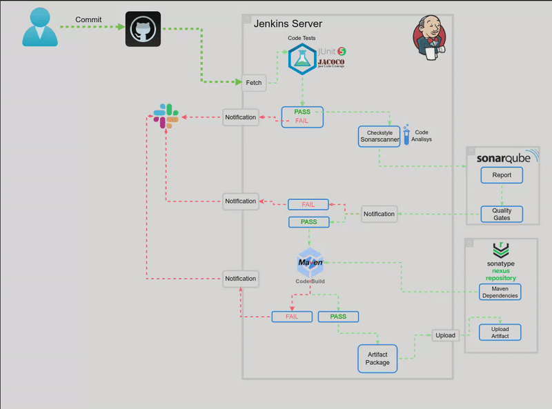

# Profile-jenkins-ci
This is a demo project showing CI pipline setup and flow.

### Tools  and technologies used

- Jenkins as continues integration server
- Git as version control system
- Maven as build tool
- Checkstyle as code analysis tool
- Sonatype Nexus as artifact/software repo 
- Sonarqube as code analysis server
- AWS EC2 server for server setup
- Slack for notification

